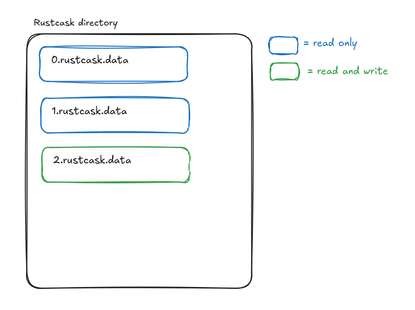
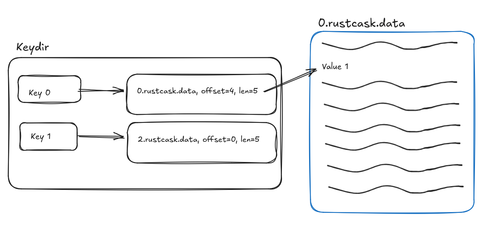

[](https://crates.io/crates/rustcask)
[](https://docs.rs/rustcask/)


# Rustcask
Rustcask is a fast and efficient key-value storage engine implemented in Rust.
It's based on [Bitcask,
"A Log-Structured Hash Table for Fast Key/Value Data"](https://riak.com/assets/bitcask-intro.pdf).

I've had a lot of fun learning Rust, exploring different key-value store architectures, and creating this project, so I'm excited to share it. I encourage you to check it out, especially if you have experience with Rust. I would love to hear feedback you have! 

While working on this project, I drew a lot of inspiration from the blog article, 
["Build a BLAZINGLY FAST key-value store with Rust"](https://www.tunglevo.com/note/build-a-blazingly-fast-key-value-store-with-rust/).

## Design
### Bitcask
Rustcask follows the design of Bitcask very closely. A Rustcask directory is composed of data files. At any time,
there is only one active data file. Writes are appended to that data file, and once it reaches a certain size,
the file is closed and marked read-only.



An in-memory data structure (see [keydir.rs](./src/keydir.rs)) maps each key to the data file and offset of the 
most recently written value for that key. This means that reads require only a single disk seek.

On restarts, Rustcask traverses data files within the Rustcask directory to rebuild the keydir.



By writing values to disk sequentially, Bitcask and Rustcask are able to achieve high write throughput. 
However, this append-only strategy means that stale (overwritten) values accumulate in the data files. This is why Bitcask and Rustcask
provide a `merge` function, which compacts data files and removes stale keys. In production environments, managing background data file compaction
without affecting the key-value store's performance is a tricky problem.

### Serialization Format
Instead of the serialization format described in the Bitcask paper, I decided to use the [bincode](https://docs.rs/bincode/latest/bincode/) crate. 
[Bincode is a compact serialization format that was built explicitly for the Rust serialization ecosystem](https://tyoverby.com/posts/bincode_release.html).
It's super easy to use.

### Concurrency
A `RustCask` instance is thread safe and can be used by multiple threads concurrently.

Reads can execute concurrently because each thread gets its own set of `data_file_readers`. 
However, writes are serialized - all threads share the same `active_data_file_writer`.

### Error handling
I was inspired by this article, [Modular Errors in Rust](https://sabrinajewson.org/blog/errors), to create 
 [distinct error types for each API operation](./src/error.rs): `SetError`, `GetError`, `OpenError`, and `RemoveError`.

Set, get, open, and remove, are the "units of fallability" of this application. 
Each operation may fail for different reasons, and should have a unique error message.
Therefore, defining distinct error types for each operation makes sense.

The alternative is to have a library-wide error type like `RustCaskError`. Library wide error types are nice
because they simplify code. However, they force the client to handle errors that may not be specific to the method they're calling.

### Other design decisions
- Keep an open file handle for each data file in a Rustcask directory. This helps avoid expensive system calls to open files.
Eventually, we'll store the open file handles in a LRU cache, that way there's no risk of hitting a system's open file limit.
- Don't use memory-mapped I/O. Instead, I'm buffering standard I/O calls with `BufReader` and `BufWriter`.
  This was the simplest approach to code up, and I don't have a reason to believe that memory-mapped I/O would be more efficient.
  It might be worth testing in the future - but my guess is that the results would be dependent on the workload.

## Rustcask vs. Log-Structured Merge-Trees (LSM-trees) like LevelDB
### What are the benefits of Rustcask over LSM-tree-based storage engines?
- Rustcask's design is much simpler than LSM-tree storage engines like LevelDB. As such, it's an easy code base to maintain.
- Rustcask has less read amplification than LevelDB. For example, as described in the [WiscKey paper](https://www.usenix.org/system/files/conference/fast16/fast16-papers-lu.pdf), LevelDB has high read amplification because you may have to read up to 14
SSTable files to find the data you're looking for. In Rustcask, we store the entire keydir in memory, 
which means that reads require only a single seek.

### What are the benefits of LSM-trees like LevelDB over Rustcask
- Rustcask stores the entire key-set in memory. If your key-set won't fit in memory, then LevelDB is a much better alternative
because it stores a sparse index of the key-set in memory.
- LevelDB supports efficient range queries because it writes values to disk in sorted order. 
- LevelDB is likely much more efficient in how it manages the background compaction process.

## Usage
For examples of usage, see [the integration tests](./tests/tests.rs), or the [performance tests](./benches/readwrite.rs). 
You can also check the cargo documentation with `cargo doc --open`.

Here is a simple set-get example:
```
let mut store = RustCask::builder().open(rustcask_dir).unwrap();

let key = "leader-node".as_bytes().to_vec();
let value = "instance-a".as_bytes().to_vec();

store.set(key.clone(), value).unwrap();
store.get(&key)
```

### Synchronous mode
By default, writes to Rustcask are not immediately flushed to disk. This improves performance
because the operating system can batch writes to disk. However, you can force 
Rustcask to immediately flush all writes to disk by enabling sync mode:
```
let store = RustCask::builder()
        .set_sync_mode(true)
        .open(temp_dir.path())
        .unwrap();
```

### Logging
Rustcask links to the [log crate](https://crates.io/crates/log), and uses the provided macros to log useful information. 
For these log messages to be emitted somewhere, consumers should provide their own logger implementation.

### Merging
When performing frequent key updates, the data files in the
rustcask directory will continue to grow in size because
old values are not updated or removed in-place.

The `merge` function writes active key-values to a new set of
data files, and cleans up the old data files. This reduces the size of
the rustcask directory's contents by removing stale values.

## Performance tests
You can find performance tests under the [benches](./benches/) directory. 

I've found that for write-heavy workloads,
I'm able to achieve a write bandwidth that is very close to the max write bandwidth my disk supports:

On my local desktop, [I have a disk that supports up to 560 MB/s of sequential write throughput](https://www.mouser.com/datasheet/2/146/ssd_pro_6000p_brief-2474541.pdf).

The `bench_writes` workload shows that Rustcask is able to achieve up to 503 MB/s of write throughput.
```
Timer precision: 17 ns
readwrite                  fastest       │ slowest       │ median        │ mean          │ samples │ iters
├─ bench_writes            18.12 µs      │ 75.35 µs      │ 20.3 µs       │ 22.72 µs      │ 100     │ 100
│                          503.2 MB/s    │ 121 MB/s      │ 449.2 MB/s    │ 401.2 MB/s    
```

Read workloads also perform well, as they require only a single disk seek, and the operating system's caching layers eliminate many disk accesses anyways.


## What's next?
### Hint files
I never implemented hint files, as described in the Bitcask paper. Without hint files, 
starting up a production-size database on an existing rustcask directory would take a long time.
However, I never really intended this to be used in a production environment, which is why I left it out.

### Performance metrics
To make Rustcask production-ready, it would need to output performance metrics.
For example, amount of bytes saved during compaction, count of dead vs. live keys within a given file, etc.

### Lightweight formal methods
I recently read this paper from Amazon, 
[Using lightweight formal methods to validate a key-value storage node in Amazon S3](https://www.amazon.science/publications/using-lightweight-formal-methods-to-validate-a-key-value-storage-node-in-amazon-s3).

The authors talk about how they used lightweight formal methods to validate ShardStore, the key-value storage engine behind S3.
ShardStore is much much much more complex than Rustcask, but I still think there's some interesting takeaways from the paper to apply here.

For example, I'd like to write a test framework that performs property-based testing (section 4.1) to check conformance between Rustcask and a simple HashMap-based model.
